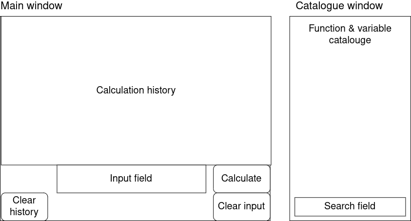

# Requirements specification

## Overview

The application is a scientific calculator. In addition to basic operations such
as addition, subtraction, multiplication and division, the application supports
more advanced operations, such as logarithmic, trigonometric and exponential
functions.

## UI sketch

## Features

### Core features

These features form the core of the application.

- [x] math operations
  - [x] basic math operations (addition, subtraction, multiplication, division)
  - [x] expression grouping using parentheses
  - [x] trigonometric functions
  - [x] logarithmic and exponential functions
  - [x] roots
  - [x] common constants (*π*, *e*)
- [x] calculation history
  - [x] can be cleared
  - [x] preserved across application restarts

### Additional features

These features will be implemented if time permits.

- [ ] searchable catalogue (functions, constants, variables)
- [x] user defined variables
- [x] user defined functions
- [x] sessions
  - [x] stores the calculation history and defined variables and functions
  - [x] can be saved to and restored from a file
- [ ] complex number support
