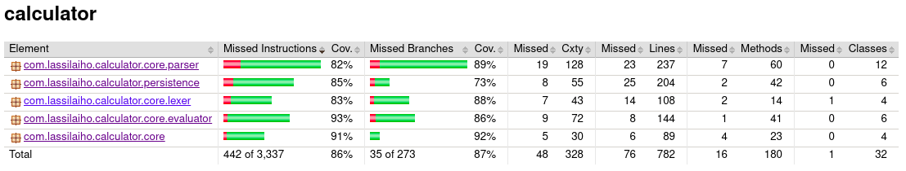

# Testing

The program is tested using automated unit and intergration tests (jUnit) and
manual system testing.

## Unit and integration testing

Program logic is mostly tested by [`CalculatorTest`], which simulates real usage
of [`Calculator`]. [`CalculatorTest`] also indirectly tests most persistence
operations by using SQL-implementations of the DAO classes with an in-memory
SQLite database.

Unit tests have been written for functionality not tested by [`CalculatorTest`],
such as equals methods on abstract syntax tree classes as well as session
management implemented by [`SqliteSessionManager`].

The UI is not automatically tested.

### Test coverage

Most functionality (excluding the UI) is tested by automatic tests. Some
relatively simple functionality, mostly `toString` methods, were untested.

## System testing

System testing was done manually.

### Installation

The installation procedure was tested by following the user manual on a Linux
machine and launching the program with different configuration parameters.

All functionality specified in the [requirements specification] and the user
manual were tested with both valid and invalid inputs.

<!-- Links -->
[`CalculatorTest`]: ../src/test/java/com/lassilaiho/calculator/core/CalculatorTest.java
[`Calculator`]: ../src/main/java/com/lassilaiho/calculator/core/Calculator.java
[`SqliteSessionManager`]: ../src/main/java/com/lassilaiho/calculator/persistence/SqliteSessionManager.java

[requirements specification]: requirements-specification.md
