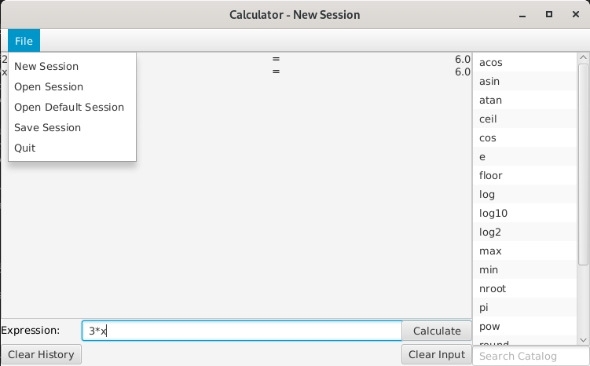

# User manual

## Installation

Download [calculator.jar]. Make sure you have Java version 11 installed.

## Running the app

The app can be run with
```
java -jar calculator.jar [options]
```
where `[options]` is a list of optional command line options for the app. The
available options are:
- `--default-session <session file>`
  - Path to the default session file. Defaults to `default.session` in the
    current working directory.
- `-h`, `--help`
  - Display usage information.

## Basic usage


Mathematical expressions are typed to the *Expression* input and calculated by
clicking the *Calculate* button. If the expression is erroneous, the cause of
the error is displayed below the input field. The input field can be cleared by
clicking the *Clear Input* button.

Calculation history is displayed at the center of the application window. The
entries are ordered from oldest to newest. The history can be cleared by
clicking the *Clear History* button.

## Sessions



The app stores stores the current session in a file. When the session is
updated, such as when new history entries are created, the session file is
automatically updated. Initially, the default session is used.

To save the current session to a file, click the *Save Session* button.

To open an existing session, click the *Open Session* button.

To open the default session, click the *Open Default Session* button.

To start a new session from scratch, click the *New Session* button. The created
session is not persisted before it is saved.

The application can be closed by clicking the *Quit* button.

## Expression syntax

Mathematical expressions can consist of
- numbers
- addition (+)
- subtraction (-)
- multiplication (*)
- division (/)
- parentheses for grouping
- constants and variables
- functions

## Built-in functions and constants

| Syntax        | Description                        |
| ------------- | ---------------------------------- |
| pi            | *π*                                |
| e             | *e*                                |
| sin(x)        | sine of *x*                        |
| cos(x)        | cosine of *x*                      |
| tan(x)        | tangent of *x*                     |
| asin(x)       | arc sine of *x*                    |
| acos(x)       | arc cosine of *x*                  |
| atan(x)       | arc tangent of *x*                 |
| sqrt(x)       | square root of *x*                 |
| nroot(x, n)   | *n*th root of *x*                  |
| pow(b, x)     | *b* raised to the power of *x*     |
| log(x)        | natural logarithm of *x*           |
| log10(x)      | base-10 logarithm of *x*           |
| log2(x)       | base-2 logarithm of *x*            |
| ceil(x)       | ceiling of *x*                     |
| floor(x)      | floor of *x*                       |
| round(x)      | *x* rounded to the nearest integer |
| max(x, y)     | maximum of *x* and *y*             |
| min(x, y)     | minimum of *x* and *y*             |

## User-defined variables and functions

The app supports defining custom session-specific functions and variables.

The syntax of variable definition is `name := expression` where *name* is the
name of the variable and *expression* is the value assigned to the variable.

The syntax of function definition is `name(param1, param2, ...) := expression`
where *name* is the name of the function followed by a parenthesized
comma-separated list of zero or more parameter names. *expression* is the
expression forming the body of the function.

User-defined variables and functions can be redefined using the same syntax as
the definition.

User-defined variables and functions can be deleted with `delete names` where
*names* is a comma-separated list of variable and function names to delete.

Valid variable and function names can consist of upper and lower case letters
from a to z, digits from 0 to 9 as well as underscores. Valid names must not
begin with a digit.


[calculator.jar]: https://github.com/lassilaiho/ot-calculator/releases/download/week6/calculator.jar
